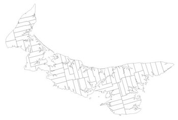
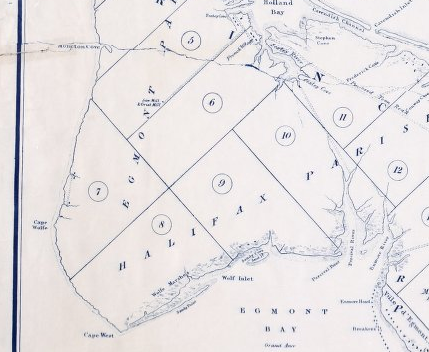
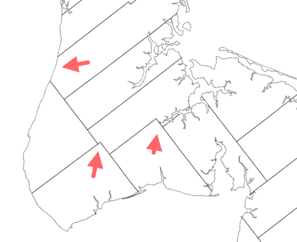

# Prince Edward Island Township Lot Boundaries

## The 1765 Samuel Holland Survey of Prince Edward Island

Samuel Holland's [1765 survey of what is now Prince Edward Island](http://www.islandimagined.ca/guides/discovery/samuel_holland) became the basis for the political geography of the island: the township lots and royaltied that Holland laid out are bred in the bone of contemporary PEI.

In 2015 the 250th anniversary of Holland's survey will be celebrated, and as part of that celebration I am working to publish a **canonical digital map of the township and royalty boundaries**, corrected from the original survey to match actual geography where required.

## GIS Files

My updated version of the Samuel Holland township and royalty lot lines is available as follows:

* [ESRI Shapefile](shp/)
* [GeoJSON](geojson/)
* [KML](kml/)

The three formats are all derived from the same original.

## Original Digital Data Source

The original data source for my map layer is [L.R.I.S., 20050725, Prince Edward Island Townships: Prince Edward Island Finance and Municipal Affairs, Taxation and Property Records, Geomatic Services, Charlottetown, Prince Edward Island, Canada](http://www.gov.pe.ca/gis/index.php3?number=1011342&lang=E). 

## Changes from Holland Map

The original Holland survey was inaccurate in several areas, especially on the western tip of the Island.  For example, in Holland's original layout, as [appears on this 1832 version](http://www.islandimagined.ca/fedora/repository/imagined%3A209165), lots 6, 7, 8, 9 and 10 fit neatly together:

The contemporary digital file, which reflects the actual geography more accurately, shows this to not actually be the case (highlights mine):

## Changes from Original Digital Data Source

From that original digital data source, I've made the following adaptations:

* Princetown Royalty was missing. I split the Lot 18 polygon along Rte. 103 from Malpeque Bay, and then along the Champion Road, across the Baltic River, and along the Roache Road and the Shore Road to the Darnley Basin, using the [1880 Meacham's Atlas Princetown Royalty map](http://137.149.200.109:8080/fedora/get/imagined:208400/ilives:jp2Sdef/getRegion?uid=&level=3) as a guide.
* Lot 50 was mislabelled as Lot 66 and Lot 66 was unlabelled. I have corrected.
* Georgetown Royalty was mislabelled as Lot 73. I have corrected.

The original ESRI Shapefile was reprojected to WGS84, edited for correctness as above, lots with multiple polygons were consolidated into a single polygon, and the polygons were simplified, using [QGIS](http://www.qgis.org/en/site/), to reduce the complexity, and
thus the file size, of the resulting map. The map was then exported from QGIS into the various formats above.

## Data License

 Digital Map of Samuel Holland Township Lots of Prince Edward Island, Canada by Peter Rukavina is licensed under a <a rel="license" href="http://creativecommons.org/licenses/by-sa/4.0/">Creative Commons Attribution-ShareAlike 4.0 International License</a>.