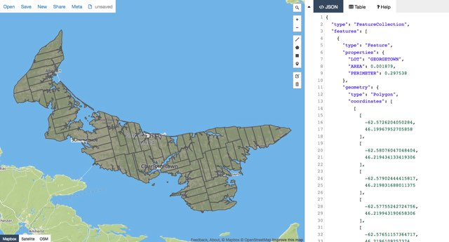

# Prince Edward Island Township Lot Boundaries GeoJSON

This is a GeoJSON representation of the [Prince Edward Island Township Lot Boundaries](https://github.com/reinvented/hollandmap).

The GeoJSON file contains 70 features:
 
 * 67 township lots
 * 3 royalties (Charlottetown, Georgetown and Princetown)
 
As JSON is the *lingua franca* of JavaScript, this file is easily integrated into JavaScript web applications.  For example, the [Leaflet library](http://leafletjs.com/) will [read and render GeoJSON files](http://leafletjs.com/examples/geojson.html).

The handy [GeoJSON.io](http://geojson.io) site is a quick tool to preview the GeoJSON file.

This file is used in my [WhatsMyLot.com](http://whatsmylot.com) web app to display lot and royalty boundaries.

## Data License

 Digital Map of Samuel Holland Township Lots of Prince Edward Island, Canada by Peter Rukavina is licensed under a <a rel="license" href="http://creativecommons.org/licenses/by-sa/4.0/">Creative Commons Attribution-ShareAlike 4.0 International License</a>.