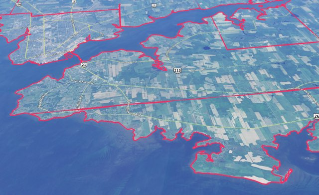

# Prince Edward Island Township Lot Boundaries KML

This is a KML representation of the [Prince Edward Island Township Lot Boundaries](../README.md).

The KML file contains 70 features:
 
 * 67 township lots
 * 3 royalties (Charlottetown, Georgetown and Princetown)
 
The easiest way to explore this file is by loading it into [Google Earth](https://www.google.com/earth/).

## Data License

 Digital Map of Samuel Holland Township Lots of Prince Edward Island, Canada by Peter Rukavina is licensed under a <a rel="license" href="http://creativecommons.org/licenses/by-sa/4.0/">Creative Commons Attribution-ShareAlike 4.0 International License</a>.